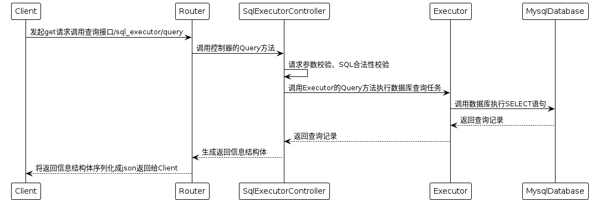
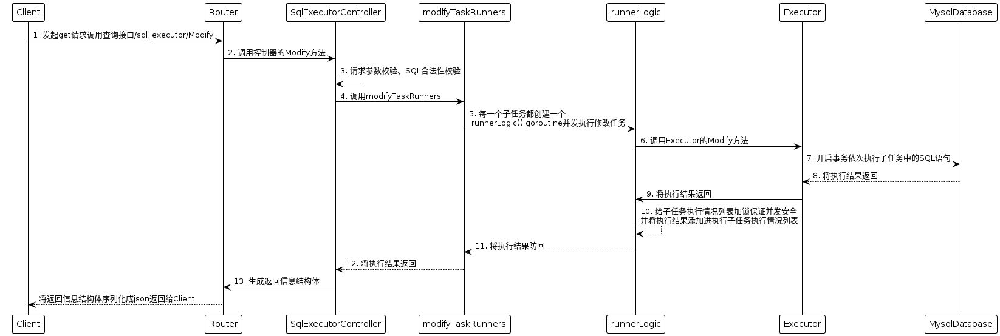

# sql_executor

## 需求

使用 Beego 框架实现一个程序，要求该程序中包含两个接口：
- 查询接口：执行 SELECT 语句，一次接收一条 SQL，并将查询结果返回；
- 修改接口：执行 UPDATE、DELETE、INSERT 语句，一次接收一条或多条 SQL，并返回 SQL 的执行结果；
  这些接口接收到的 SQL 语句，最终传递到后台数据库执行；

要求：
1. 需要有设计文档，设计文档中需包含实现原理、接口及参数等信息，可以写在程序 README 中；
2. MySQL 的配置信息（连接地址、端口号等），通过配置文件定义；
3. SQL 语句需要通过合法性校验，如果不合法则直接报错（SQL 解析可以调研并使用三方包）；
4. 如果修改接口接收到的是多个 SQL，要求启动多个协程并发到数据库执行，注意程序和数据库的并发安全问题；
5. 修改接口需要支持数据库的事务特性，即用户可以指定传入 SQL 中的某几条必须在同一个事务中执行；
6. 要求程序接收到退出信号时，需要等待当前执行中的任务都执行完毕后再退出；
7. 程序中要求包含中文注释和单元测试；
8. 不需要写前端界面，仅有接口即可。

## 实现原理

sql_executor要求程序接收到退出信号时，需要等待当前执行中的任务都执行完毕后再退出。因此我们可以利用main()
程序退出后子协程也会退出的特性，新建一个协程运行beego
server，在程序接收到退出信号后，用sync.WaitGroup阻塞住main函数，避免main()
退出。每当执行一个新任务 sync.WaitGroup 计数器加一，任务完成时计数器减一，当所有任务执行完成，sync.WaitGroup
计数器减少为零则main()退出，beego服务也随之退出。

以下为等效伪代码

```go
package main

import "sync"

// import (......
//      .....)

// 每调用一次接口执行任务 wg 计数器就加一，每一个任务完成时 wg 计数器就减一
var wg sync.WaitGroup

func main() {

  // 连接数据库等初始化操作.......

  go beego.Run()

  stop := make(chan os.Signal, 1)
  // 监听发送给该程序的退出信号，若接收到退出信号后传入到stop中
  signal.Notify(stop, syscall.SIGHUP,
    syscall.SIGINT,
    syscall.SIGTERM,
    syscall.SIGQUIT)

  // 在程序接收退出信号前阻塞住main()
  <-stop

  // 在程序所有任务完成前阻塞住main()
  wg.Wait()
}

```

#### 查询接口时序图



#### 修改接口时序图



## 接口设计

### 查询接口

请求方法: `GET`

请求路径: `/sql_executor/query`

请求参数:

| 字段    | 说明               | 类型     | 备注 | 是否必填 |
|-------|------------------|--------|----|------|
| sql   | 查询语句，末尾不可以带分号`;` | string |    | 是    |
| retry |  允许重试的次数                | Number |   | 否     |

返回参数:

| 字段      | 说明          | 类型     | 备注    | 是否必填 |
|---------|-------------|--------|-------|------|
| code    | 业务状态码       | Number |       | 是    |
| count   | 返回的查询结果记录数  | Number |       | 是    |
| sql     | 查询语句        | string |       | 是    |
| items   | 查询结果        | Array  |       | 否    |
| retry   | 允许重试的次数     | Number |  | 是    |
| err_msg | 异常或者成功的消息   | string |       | 是    |

示例: [接口功能测试](./tests/function_test.md#查询接口测试用例)

### 修改接口

请求方法: `POST` `Content-Type: application/json`

请求路径: `/sql_executor/query`

请求参数: 

| 字段           | 说明                        | 类型     | 备注    | 是否必填 |
|--------------|---------------------------|--------|-------|------|
| transactions | 存放事务，每个事务可包含多条sql语句       | Array  |       | 是    |
| sqls         | 存放SQL信息列表                 | Array  |       | 是    |
| id           | 用于给同一事务中的sql语句或给不同事务编号    | Number |       | 否    |
| name         | 给sql或事务命名                 | String |       | 否    |
| sql          | UPDATE、DELETE 或 INSERT 语句 | String |       | 是    |
| timeout      | 执行事务的超时时间                 | Number | 以秒为单位 | 否    |


返回参数:

| 字段       | 说明                        | 类型     | 备注    | 是否必填 |
|----------|---------------------------|--------|-------|------|
| code     | 业务状态码                     | Number |       | 是    |
| items    | 返回事务信息列表                  | Array  |       | 否    |
| id       | 用于给同一事务中的sql语句或给不同事务编号    | Number |       | 否    |
| sql_info | 用于有语法错误的sql语句信息           | Array  |       | 否    |
| sql      | UPDATE、DELETE 或 INSERT 语句 | String |       | 是    |
| name     | 给sql或事务命名                 | String |       | 否    |
| count    | 表示重试次数或修改语句作用生效的行数或       | Number |       | 是    |
| retry    | 允许重试的次数                   | Number |       | 否    |
| err_msg  | 事务异常或者成功的消息、用于描述所有事务的执行情况 | string |       | 是    |
| msg      | 用于描述所有事务的执行情况             | string |       | 否    | 
| timeout  | 执行事务的超时时间                 | Number | 以秒为单位 | 否    |

示例: [接口功能测试](./tests/function_test.md#修改接口测试用例)

## 测试

### 接口功能测试

用于开发过程中快速验证，详情内容请参照[接口功能测试](./tests/function_test.md)

### 单元测试
